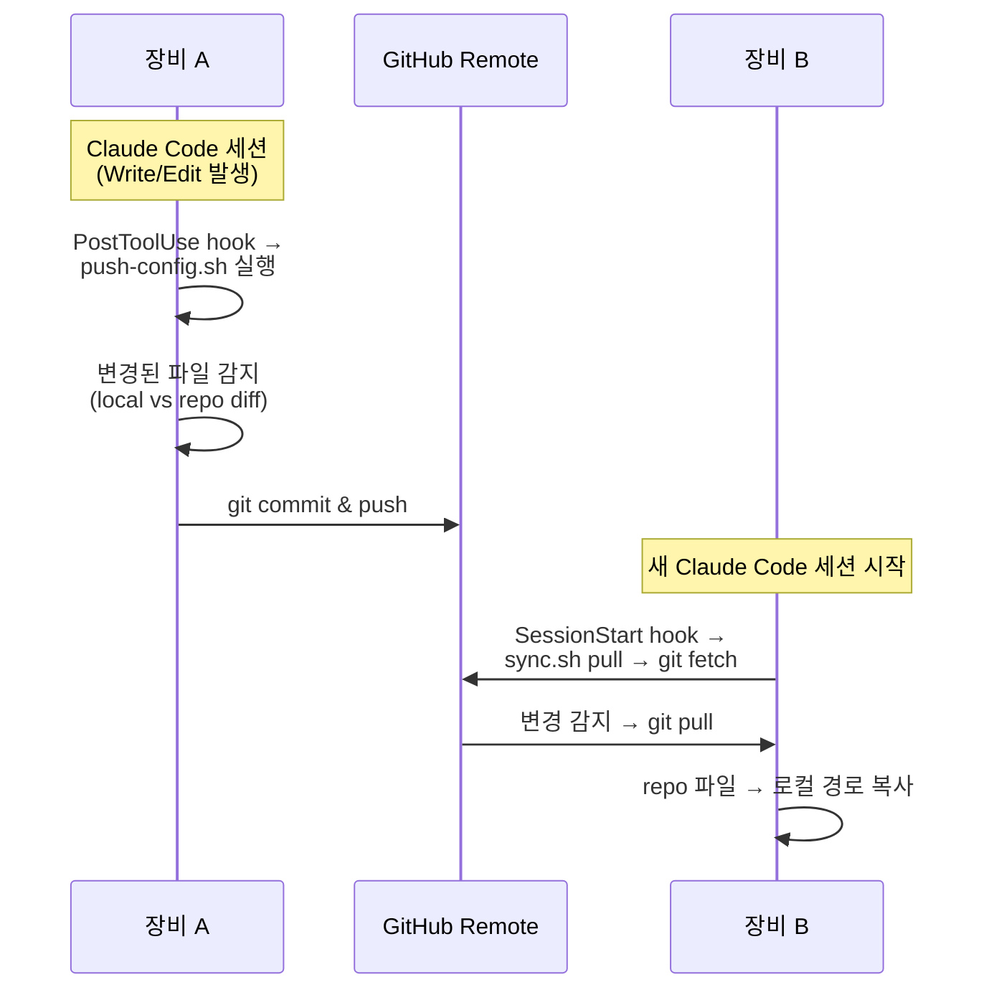
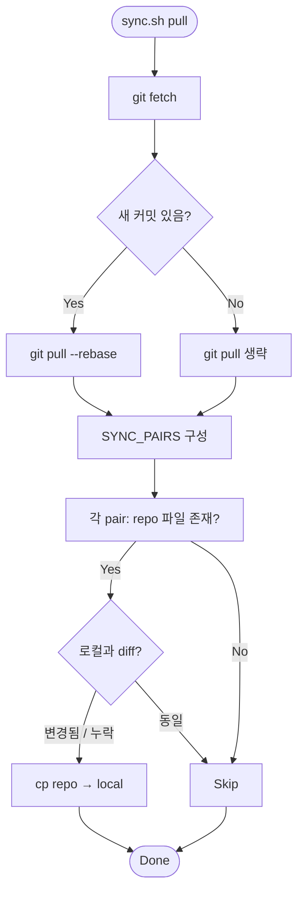
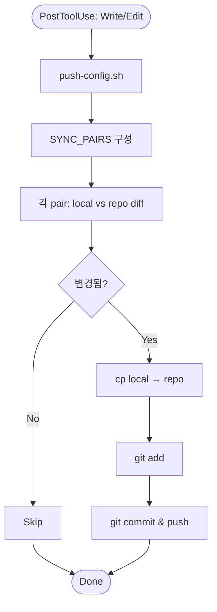
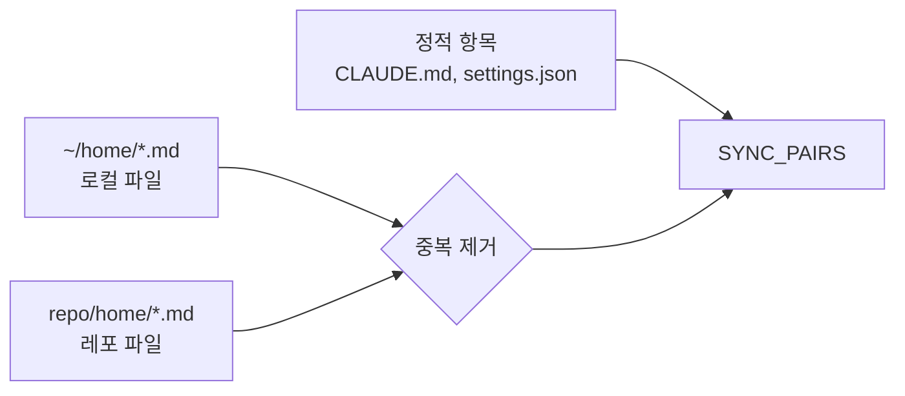

🌐 [English](README.md) | [한국어](README.ko.md)

# claude-config

Claude Code 설정을 관리하는 저장소 — 글로벌 + 홈 레벨.

심볼릭 링크 없이, 스크립트를 통해 **파일 복사 방식**으로 동기화한다.

## 관리 대상

| 레포 경로 | 로컬 경로 | 용도 |
|---|---|---|
| `CLAUDE.md` | `~/.claude/CLAUDE.md` | 글로벌 행동 지침 (모든 프로젝트에 적용) |
| `settings.json` | `~/.claude/settings.json` | 글로벌 모델, 권한, hooks 설정 |
| `home/CLAUDE.md` | `~/home/CLAUDE.md` | 홈 레벨 프로젝트 지침 |
| `home/settings.json` | `~/home/.claude/settings.json` | 홈 레벨 권한 설정 |
| `home/*.md` (자동) | `~/home/*.md` | 지식 파일 (CLAUDE.md 제외, 자동 수집) |

## 새 머신 초기 세팅

```bash
git clone git@github.com:WoojinAhn/claude-config.git ~/path/to/claude-config
cd ~/path/to/claude-config
./sync.sh setup
```

`setup` 실행 시:
1. 관리 대상 파일별로 repo와 로컬의 diff 표시
2. 파일별 덮어쓰기 여부 확인 (기존 파일은 `*.bak`으로 백업)
3. 필요한 디렉토리 생성 (`~/home/.claude/` 등)
4. `push-config.sh`를 `~/.claude/`에 설치 (auto-push hook용)

## 사용법

```bash
# 차이점 확인
./sync.sh diff

# remote -> 로컬 반영 (push-config.sh도 재설치)
./sync.sh pull

# 로컬 -> remote 반영 (수동)
./sync.sh push

# 동기화 상태 확인
./sync.sh status
```

## Auto-Sync



### Auto-Pull (SessionStart)

새 세션 시작 시 `SessionStart` hook이 `sync.sh pull`을 실행한다. remote를 fetch한 뒤 새 커밋이 있으면 pull하고, **git 변경 유무와 관계없이 항상 repo → 로컬 파일 복사를 수행**한다 — 로컬 파일이 삭제됐을 때도 자동 복구된다.



### Auto-Push (PostToolUse)

`PostToolUse` hook이 Claude Code 세션에서 `Write|Edit` 시마다 `~/.claude/push-config.sh`를 실행한다. 이 스크립트는 `setup` 시 repo 경로가 주입되어 생성되므로, 커밋된 파일에 하드코딩된 경로가 없다.



### SYNC_PAIRS 구성 방식



## 파일 추가

- **`~/home/*.md`**: 로컬(`~/home/`)과 레포(`home/`) 양쪽을 자동 수집 — 어느 쪽에 파일을 추가해도 자동으로 감지된다.
- **그 외 파일**: `sync.sh` 내 `SYNC_PAIRS` 배열에 항목을 추가한다.

```bash
SYNC_PAIRS=(
    "$CLAUDE_DIR/CLAUDE.md|CLAUDE.md|[global] CLAUDE.md"
    ...
    "$HOME_DIR/.claude/newfile.json|home/newfile.json|[home] newfile.json"
)
```
