🌐 [English](README.md) | [한국어](README.ko.md)

# claude-config

A repository for managing Claude Code settings — both global and home-level.

Syncs via **file copy** through a script — no symlinks.

## Managed Files

| Repo Path | Local Path | Purpose |
|---|---|---|
| `CLAUDE.md` | `~/.claude/CLAUDE.md` | Global behavior instructions (applied to all projects) |
| `settings.json` | `~/.claude/settings.json` | Global model, permissions, hooks settings |
| `home/CLAUDE.md` | `~/home/CLAUDE.md` | Home-level project instructions |
| `home/settings.json` | `~/home/.claude/settings.json` | Home-level permissions |
| `home/*.md` (auto) | `~/home/*.md` | Knowledge files (auto-discovered, excluding CLAUDE.md) |

## New Machine Setup

```bash
git clone git@github.com:WoojinAhn/claude-config.git ~/path/to/claude-config
cd ~/path/to/claude-config
./sync.sh setup
```

`setup` will:
1. Show diff between repo and local for each managed file
2. Ask whether to overwrite each file (local file is backed up as `*.bak`)
3. Create directories if needed (`~/home/.claude/`, etc.)
4. Install `push-config.sh` into `~/.claude/` (used by the auto-push hook)

## Usage

```bash
# Show diff between repo and local
./sync.sh diff

# Pull: remote -> local (also reinstalls push-config.sh)
./sync.sh pull

# Push: local -> remote (manual)
./sync.sh push

# Check sync status
./sync.sh status
```

## Auto-Sync

```mermaid
sequenceDiagram
    participant A as Machine A
    participant R as GitHub Remote
    participant B as Machine B

    Note over A: Claude Code session<br/>(Write/Edit happens)
    A->>A: PostToolUse hook triggers<br/>push-config.sh
    A->>A: Detect changed files<br/>(diff local vs repo)
    A->>R: git commit & push

    Note over B: New Claude Code session starts
    B->>R: SessionStart hook triggers<br/>sync.sh pull → git fetch
    R->>B: Changes detected → git pull
    B->>B: Copy repo files → local paths
```



### Auto-Pull (SessionStart)

On new session startup, the `SessionStart` hook runs `sync.sh pull`. It fetches from remote, pulls if there are new commits, and **always copies repo files to local** — so missing local files are restored even if git is already up to date.

### Auto-Push (PostToolUse)

The `PostToolUse` hook triggers `~/.claude/push-config.sh` on every `Write|Edit` in Claude Code sessions. This script is generated by `setup` with the repo path baked in — no hardcoded paths in committed files.

## Adding Files

- **`~/home/*.md`**: Automatically discovered from both local (`~/home/`) and repo (`home/`) — files added to either side are picked up automatically.
- **Other files**: Add entries to the `SYNC_PAIRS` array in `sync.sh`:

```bash
SYNC_PAIRS=(
    "$CLAUDE_DIR/CLAUDE.md|CLAUDE.md|[global] CLAUDE.md"
    ...
    "$HOME_DIR/.claude/newfile.json|home/newfile.json|[home] newfile.json"
)
```
